<title>Report - Personal activity</title>
<h3><span style="text-align: center; font-weight : bold;">Initialization code</span></h3>


```r
knitr::opts_chunk$set(echo = TRUE)
library(grid)
library(ggplot2)
library(dplyr)
```

```
## 
## Attachement du package : 'dplyr'
```

```
## Les objets suivants sont masqués depuis 'package:stats':
## 
##     filter, lag
```

```
## Les objets suivants sont masqués depuis 'package:base':
## 
##     intersect, setdiff, setequal, union
```

```r
library(magrittr)
library(patchwork)
library(lubridate)
```

```
## 
## Attachement du package : 'lubridate'
```

```
## Les objets suivants sont masqués depuis 'package:base':
## 
##     date, intersect, setdiff, union
```
<br>
<h3><span style="text-align: center; font-weight : bold;">I. Code for reading in the dataset</span></h3>
1. Unzip file, open and store csv file into the object <span style="color: red;font-weight : bold;">my_data</span> 

```r
unzip(zipfile = "activity.zip")
my_data<- read.csv(file = "activity.csv")
```

2. The object <span style="color: red;font-weight : bold;">my_data</span> contains three variables :

```r
names(my_data)
```

```
## [1] "steps"    "date"     "interval"
```
<br>
<h3><span style="text-align: center; font-weight : bold;">II. Histogram of the total number of steps taken each day</span></h3>
1. Define the variable <span style="color: blue;font-weight : bold;">date</span> as factor for <span style="color: red;font-weight : bold;">my_data</span>

```r
my_data$date <- as.factor(my_data$date)
```

2. How many levels do we have now ?

```r
nlevels(my_data$date)
```

```
## [1] 61
```
There is 61 days in <span style="color: red;font-weight : bold;">my_data</span>

3. Calculation of the sum of steps per day and store it in <span style="color: red;font-weight : bold;">my_sum</span>

```r
my_sum <- aggregate(steps ~ date, na.action = NULL, data = my_data, FUN = sum, na.rm=TRUE)
```

4. Plot <span style="color: red;font-weight : bold;">my_sum</span> into a histogram


```r
my_hist <- my_sum %>%
 ggplot(aes(x=date, y=steps, fill=date)) +
 geom_bar(stat="identity",color="black",alpha=0.6)+
 xlab("Day") + ylab("Steps") +
theme(
 plot.title = element_text(color="red", size=24, face="bold.italic",hjust=0.5),
 axis.title.x = element_text(color="#993333", size=20, face="bold"),
 axis.text.x = element_text(color="#993333", size=10, angle = 90,vjust = 0.5, hjust=1),
 axis.title.y = element_text(color="darkgreen", size=20, face="bold"),
 axis.text.y = element_text(face="bold", color="darkgreen", size=14),
 legend.text = element_text(size=12)
)
print(my_hist + plot_layout(guides = "collect" )& theme(legend.position = "bottom"))
```

<!-- -->

<br>
<h3><span style="text-align: center; font-weight : bold;">III. Mean and median number of steps taken each day</span></h3>

1. In this part, the mean and median are related to the number of steps across all 61 days.

```r
my_means <- mean(my_sum[,2])
writeLines(paste("The mean number of steps is :", round(my_means,digits = 1), sep='\n'))
```

```
## The mean number of steps is :
## 9354.2
```

```r
my_median <- median(my_sum[,2])
writeLines(paste("The median number of steps is :",my_median, sep='\n'))
```

```
## The median number of steps is :
## 10395
```
<br>
2. Another case can be when days with a number of steps less than 500 are deleted.

```r
my_sub_sum <- my_sum %>% filter(steps>499)
my_means2 <- mean(my_sub_sum[,2])
writeLines(paste("In the second case, the mean number of steps is :", round(my_means2,digits = 1), sep='\n'))
```

```
## In the second case, the mean number of steps is :
## 11185.1
```

```r
my_median2 <- median(my_sub_sum[,2])
writeLines(paste("In the second case, the median number of steps is :",my_median2, sep='\n'))
```

```
## In the second case, the median number of steps is :
## 11015
```

<br>
<h3><span style="text-align: center; font-weight : bold;">IV. Time series plot of the average number of steps taken</span></h3>

1. Define the variable <span style="color: blue;font-weight : bold;">interval</span> as factor for <span style="color: red;font-weight : bold;">my_data</span> and create a new object <span style="color: red;font-weight : bold;">my_interv_means</span> which contains the mean across the 61 days for each interval.

```r
my_data$interval <- as.factor(my_data$interval)
my_interv_means <- aggregate(steps ~ interval, na.action = NULL, data = my_data, FUN = mean, na.rm=TRUE)
my_interv_means$interval <- as.numeric(levels(my_data$interval))
```

2. Define some useful object

```r
# Data frame to store values
my_tmp<-data.frame(interval = integer(),
                   steps = numeric())
# Vector for colors
red_value = green_value = 1

# Initializing a ggplot graph
my_plt <- ggplot() + ggtitle("One plot per hour") + 
  theme(plot.title = element_text(size = 10, hjust=0.5))
# Maximum normalization for the y-axis
my_y_lim <- ylim(0,max(my_interv_means[,2]))
```

3. With ```for``` a loop, subset the object <span style="color: red;font-weight : bold;">my_interv_means</span> into 24 groups : one by hour, then create a ggplot object and store it in <span style="color: red;font-weight : bold;">my_plt</span> by successive addition. Each plot contains the average number of steps in every hour.

```r
for (i in seq(0, as.numeric(my_interv_means[length(my_interv_means[,1]),1]), by=100)){
  for (j in 1:length(my_interv_means[,1])){
    if (my_interv_means[j,1]>=i & my_interv_means[j,1]<=i+55){
      my_tmp %<>% add_row(my_interv_means[j,])
    }
  }

  my_hist <- my_tmp %>%
    ggplot(aes(x = interval, y = steps)) +
    geom_bar(stat="identity",color=rgb(red_value,green_value,0.6)) +

    # The xlim is extended to include bordering values, that's why there is " - 6" and " + 6"
    my_y_lim+
    theme (
      axis.text.x = element_text(color = "#993333", size=10, angle = 90, vjust = 0.5, hjust=1),
    )

  my_plt <- my_plt + my_hist
  green_value = green_value - 0.01
  red_value = red_value - 0.02

  # Subset storage object reset
  my_tmp<-data.frame(interval = integer(),
                     steps = numeric())
}
```
4. Print the plot

```r
print(my_plt)
```

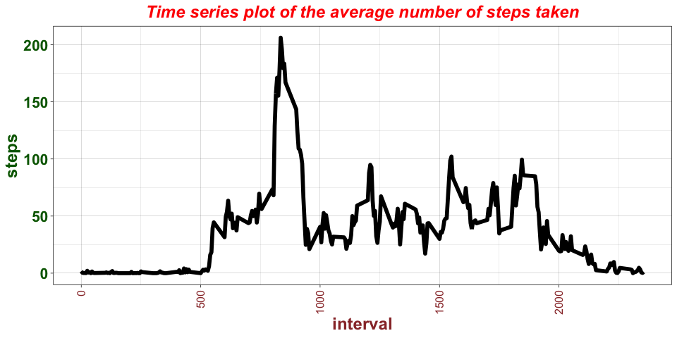<!-- -->

5. Another case can be when interval with a number of steps less than 5 are deleted.

```r
my_subset_data <- my_data %>% filter(steps > 4)
my_interv_means_sub <- aggregate(steps ~ interval, na.action = NULL, data = my_subset_data, FUN = mean, na.rm=TRUE)
my_interv_means_sub <- droplevels(my_interv_means_sub)
my_interv_means_sub$interval <- as.numeric(levels(my_interv_means_sub$interval))

# Data frame to store values
my_tmp<-data.frame(interval = integer(),
                   steps = numeric())
# Vector for colors
red_value = green_value = 1

# Initializing a ggplot graph
my_plt_sub <- ggplot() + ggtitle("One plot per hour") +
  theme(plot.title = element_text(size = 10, hjust=0.5))
# Maximum normalization for the y-axis
my_y_lim <- ylim(0,max(my_interv_means_sub[,2]))


for (i in seq(0, as.numeric(my_interv_means_sub[length(my_interv_means_sub[,1]),1]), by=100)){
  for (j in 1:length(my_interv_means_sub[,1])){
    if (my_interv_means_sub[j,1]>=i & my_interv_means_sub[j,1]<=i+55) {
      my_tmp %<>% add_row(my_interv_means_sub[j,])
    }
  }

  my_hist <- my_tmp %>%
    ggplot(aes(x = interval, y = steps)) +
    geom_bar(stat="identity",color=rgb(red_value,green_value,0.6)) +

    # The xlim is extended to include bordering values, that's why there is " - 6" and " + 6"
    my_y_lim+
    theme (
      axis.text.x = element_text(color = "#993333", size=10, angle = 90, vjust = 0.5, hjust=1),
    )

  my_plt_sub <- my_plt_sub + my_hist
  green_value = green_value - 0.01
  red_value = red_value - 0.02

  # Subset storage object reset
  my_tmp<-data.frame(interval = integer(),
                     steps = numeric())
}
```
6. Print the second plot

```r
print(my_plt_sub)
```

<!-- -->
<br>
<h3><span style="text-align: center; font-weight : bold;">V. The 5-minute interval that, on average, contains the maximum number of steps</span></h3>

```r
my_max <- max(my_interv_means[,2])
my_row_max <- which(my_interv_means[,2]==max(my_interv_means[,2]))
writeLines(paste("The 5-minute interval that, on average, contains the maximum number of steps is :", my_interv_means[my_row_max,1], sep='\n'))
```

```
## The 5-minute interval that, on average, contains the maximum number of steps is :
## 835
```

```r
writeLines(paste("This maximum value is :", round(my_interv_means[my_row_max,2],1),"steps.", sep=' '))
```

```
## This maximum value is : 206.2 steps.
```
<br>
<h3><span style="text-align: center; font-weight : bold;">VI. Code to describe and show a strategy for imputing missing data </span></h3>
1. The idea is, in order, to :  
<ul>
    <li>use the ``` aggregate()``` function with the parameter ```na.action = NULL``` ;</li>
    <li>set the parameter ``` FUN``` equal to a function like ``` sum()``` ;</li>
    <li>add extra parameter ```na.rm = TRUE```.</li>
</ul>
2. In sections III. 2. and IV. 5. other more advanced explanations have been provided :
<ul>
    <li>this is to get rid of values that seem outliers: if the number of steps in a day is less than 500 steps, the day is not taken into account ;</li>
    <li>in the same interval, through each day, if the number of steps is less than 5, the observation is deleted.</li>
    <li>add extra parameter ```na.rm = TRUE```</li>
</ul>

<br>
<h3><span style="text-align: center; font-weight : bold;">VII. Histogram of the total number of steps taken each day after missing values are imputed</span></h3>
1. Define the variable <span style="color: blue;font-weight : bold;">date</span> as factor for <span style="color: red;font-weight : bold;">my_data</span>

```r
my_data$date <- as.factor(my_data$date)
```

2. Calculation of the sum of steps per day and store it in <span style="color: red;font-weight : bold;">my_sum</span> after removing ```NA``` by passing the parameter ```na.rm = TRUE``` to the function ```sum()``` throught the function ```aggregate()```

```r
my_sum_bis <- aggregate(steps ~ date, na.action = NULL, data = my_data, FUN = sum, na.rm=TRUE)
```

3. Plot <span style="color: red;font-weight : bold;">my_sum_bis</span> into a histogram
<span style="color: black;font-weight : bold;">The graph below is exactly the same as the one provide in II. 4.</span>

```r
my_hist <- my_sum_bis %>%
 ggplot(aes(x=date, y=steps, fill=date)) +
 geom_bar(stat="identity",color="black",alpha=0.6)+
 xlab("Day") + ylab("Steps") +
theme(
 plot.title = element_text(color="red", size=24, face="bold.italic",hjust=0.5),
 axis.title.x = element_text(color="#993333", size=20, face="bold"),
 axis.text.x = element_text(color="#993333", size=10, angle = 90,vjust = 0.5, hjust=1),
 axis.title.y = element_text(color="darkgreen", size=20, face="bold"),
 axis.text.y = element_text(face="bold", color="darkgreen", size=14),
 legend.text = element_text(size=12)
)
print(my_hist + plot_layout(guides = "collect" )& theme(legend.position = "bottom"))
```

<!-- -->

<br>
<h3><span style="text-align: center; font-weight : bold;">VIII. Panel plot comparing the average number of steps taken per 5-minute interval across weekdays and weekends</span></h3>

1. Redefine the variable <span style="color: blue;font-weight : bold;">date</span> as date by using the package ```lubridate```

```r
my_data$date <- ymd(my_data$date)
print(class(my_data$date))
```

```
## [1] "Date"
```

2. Define some useful object

```r
# Data frame to store values
my_tmp <- data.frame(interval = integer(),
                     steps = numeric())
my_data_weekDAYS<- data.frame(steps = numeric(),
                               date = POSIXct(),
                               interval = integer())
my_data_weekENDS <- data.frame(steps = numeric(),
                               date = POSIXct(),
                               interval = integer())

                               
# Vector for colors
red_value = green_value = 1

# Initializing two ggplot graphs
my_plt_weekDAYS <- ggplot() + ggtitle("One plot per hour") + 
  theme(plot.title = element_text(size = 10, hjust=0.5))
my_plt_weekENDS <- ggplot() + ggtitle("One plot per hour") + 
  theme(plot.title = element_text(size = 10, hjust=0.5))
```

3. Select and store in the object <span style="color: red;font-weight : bold;">my_data_weekDAYS</span> the weekdays by using the function ```wday()```.

```r
my_data_weekDAYS <- my_data[wday(my_data$date) %in% seq(1,5,1),]
```

4. Define the variable <span style="color: blue;font-weight : bold;">interval</span> as factor for <span style="color: red;font-weight : bold;">my_data_weekDAYS</span>. Then, create a new object <span style="color: red;font-weight : bold;">my_interv_weekDAYS_means</span> which contains the mean across the 61 days for each interval by using the function ```agregate()```.

```r
my_data_weekDAYS$interval <- as.factor(my_data_weekDAYS$interval)
my_interv_weekDAYS_means <- aggregate(steps ~ interval, na.action = NULL, data = my_data_weekDAYS, FUN = mean, na.rm=TRUE)
my_interv_weekDAYS_means$interval <- as.numeric(levels(my_interv_weekDAYS_means$interval))
# Maximum normalization for the y-axis
my_y_lim <- ylim(0,max(my_interv_weekDAYS_means[,2]))
```

5. With a ```for``` loop, subset the object <span style="color: red;font-weight : bold;">my_interv_weekDAYS_means</span> into 24 groups : one by hour. Then, create a ggplot object and store it in <span style="color: red;font-weight : bold;">my_plt_weekDAYS</span> by successive addition. Each plot contains the average number of steps in every hour for weekdays only.

```r
for (i in seq(0, as.numeric(my_interv_weekDAYS_means[length(my_interv_weekDAYS_means[,1]),1]), by=100)) {
    for (j in 1:length(my_interv_weekDAYS_means[,1])){
      if (my_interv_weekDAYS_means[j,1]>=i & my_interv_weekDAYS_means[j,1]<=i+55){
        my_tmp %<>% add_row(my_interv_weekDAYS_means[j,])
      }
    }
    my_hist <- my_tmp %>%
      ggplot(aes(x = interval, y = steps)) +
      geom_bar(stat="identity",color=rgb(red_value,green_value,0.6)) +
  
      # The xlim is extended to include bordering values, that's why there is " - 6" and " + 6"
      my_y_lim+
      theme (
        axis.text.x = element_text(color = "#993333", size=10, angle = 90, vjust = 0.5, hjust=1),
      )
  
    my_plt_weekDAYS <- my_plt_weekDAYS + my_hist
    green_value = green_value - 0.01
    red_value = red_value - 0.02
  
    # Subset storage object reset
    my_tmp <- data.frame(interval = integer(),
                       steps = numeric())
}
```

6. Select and store in the object <span style="color: red;font-weight : bold;">my_data_weekENDS</span> the weekends by using the function ```wday()```.

```r
my_data_weekENDS <- my_data[wday(my_data$date) %in% seq(6,7,1),]
```

7. Define the variable <span style="color: blue;font-weight : bold;">interval</span> as factor for <span style="color: red;font-weight : bold;">my_data_weekENDS</span>. Then, create a new object <span style="color: red;font-weight : bold;">my_interv_weekENDS_means</span> which contains the mean across the 61 days for each interval by using the function ```agregate()```.

```r
my_data_weekENDS$interval <- as.factor(my_data_weekENDS$interval)
my_interv_weekENDS_means <- aggregate(steps ~ interval, na.action = NULL, data = my_data_weekENDS, FUN = mean, na.rm=TRUE)
my_interv_weekENDS_means$interval <- as.numeric(levels(my_interv_weekENDS_means$interval))
# Maximum normalization for the y-axis
my_y_lim <- ylim(0,max(my_interv_weekENDS_means[,2]))
```

8. With a ```for``` loop, subset the object <span style="color: red;font-weight : bold;">my_interv_weekENDS_means</span> into 24 groups : one by hour. Then, create a ggplot object and store it in <span style="color: red;font-weight : bold;">my_plt_weekENDS</span> by successive addition. Each plot contains the average number of steps in every hour for weekends only.

```r
for (i in seq(0, as.numeric(my_interv_weekENDS_means[length(my_interv_weekENDS_means[,1]),1]), by=100)) {
    for (j in 1:length(my_interv_weekENDS_means[,1])){
      if (my_interv_weekENDS_means[j,1]>=i & my_interv_weekENDS_means[j,1]<=i+55){
        my_tmp %<>% add_row(my_interv_weekENDS_means[j,])
      }
    }
    my_hist <- my_tmp %>%
      ggplot(aes(x = interval, y = steps)) +
      geom_bar(stat="identity",color=rgb(red_value,green_value,0.6)) +
  
      # The xlim is extended to include bordering values, that's why there is " - 6" and " + 6"
      my_y_lim +
      theme (
        axis.text.x = element_text(color = "#993333", size=10, angle = 90, vjust = 0.5, hjust=1),
      )
  
    my_plt_weekENDS <- my_plt_weekENDS + my_hist
    green_value = green_value - 0.01
    red_value = red_value - 0.02
  
    # Subset storage object reset
    my_tmp <- data.frame(interval = integer(),
                       steps = numeric())
}
```

9. Print plots

```r
print(my_plt_weekDAYS)
```

<!-- -->

```r
print(my_plt_weekENDS)
```

<!-- -->

10. Another case can be when interval with a number of steps less than 5 are deleted.

```r
# Data frame to store values
my_tmp <- data.frame(interval = integer(),
                     steps = numeric())
my_data_weekDAYS_sub<- data.frame(steps = numeric(),
                               date = POSIXct(),
                               interval = integer())
my_data_weekENDS_sub <- data.frame(steps = numeric(),
                               date = POSIXct(),
                               interval = integer())

# Subset only the interval with unless 5 steps every 5 minutes
my_subset_data <- my_data %>% filter(steps > 4)
my_data_weekDAYS_sub <- my_subset_data[wday(my_subset_data$date) %in% seq(1,5,1),]
my_data_weekENDS_sub <- my_subset_data[wday(my_subset_data$date) %in% seq(6,7,1),]

                               
# Vector for colors
red_value = green_value = 1

# Initializing two ggplot graphs
my_plt_weekDAYS_sub <- ggplot() + ggtitle("One plot per hour") + 
  theme(plot.title = element_text(size = 10, hjust=0.5))
my_plt_weekENDS_sub <- ggplot() + ggtitle("One plot per hour") + 
  theme(plot.title = element_text(size = 10, hjust=0.5))


my_data_weekDAYS_sub$interval <- as.factor(my_data_weekDAYS_sub$interval)
my_interv_weekDAYS_means_sub <- aggregate(steps ~ interval, na.action = NULL, data = my_data_weekDAYS_sub, FUN = mean, na.rm=TRUE)
my_interv_weekDAYS_means_sub <- droplevels(my_interv_weekDAYS_means_sub)
my_interv_weekDAYS_means_sub$interval <- as.numeric(levels(my_interv_weekDAYS_means_sub$interval))
# Maximum normalization for the y-axis
my_y_lim_1 <- ylim(0,max(my_interv_weekDAYS_means_sub[,2]))

my_data_weekENDS_sub$interval <- as.factor(my_data_weekENDS_sub$interval)
my_interv_weekENDS_means_sub <- aggregate(steps ~ interval, na.action = NULL, data = my_data_weekENDS_sub, FUN = mean, na.rm=TRUE)
my_interv_weekENDS_means_sub <- droplevels(my_interv_weekENDS_means_sub)
my_interv_weekENDS_means_sub$interval <- as.numeric(levels(my_interv_weekENDS_means_sub$interval))
# Maximum normalization for the y-axis
my_y_lim_2 <- ylim(0,max(my_interv_weekENDS_means_sub[,2]))

green_value = 0.3
red_value = 0.4

for (i in seq(0, as.numeric(my_interv_weekDAYS_means_sub[length(my_interv_weekDAYS_means_sub[,1]),1]), by=100)) {
    for (j in 1:length(my_interv_weekDAYS_means_sub[,1])){
      if (my_interv_weekDAYS_means_sub[j,1]>=i & my_interv_weekDAYS_means_sub[j,1]<=i+55){
        my_tmp %<>% add_row(my_interv_weekDAYS_means_sub[j,])
      }
    }
    my_hist <- my_tmp %>%
      ggplot(aes(x = interval, y = steps)) +
      geom_bar(stat="identity",color=rgb(red_value,green_value,0.6)) +
  
      # The xlim is extended to include bordering values, that's why there is " - 6" and " + 6"
      my_y_lim_1 +
      theme (
        axis.text.x = element_text(color = "#993333", size=10, angle = 90, vjust = 0.5, hjust=1),
      )
  
    my_plt_weekDAYS_sub <- my_plt_weekDAYS_sub + my_hist
    green_value = green_value + 0.01
    red_value = red_value + 0.02
  
    # Subset storage object reset
    my_tmp <- data.frame(interval = integer(),
                       steps = numeric())
}

for (i in seq(0, as.numeric(my_interv_weekENDS_means_sub[length(my_interv_weekENDS_means_sub[,1]),1]), by=100)) {
    for (j in 1:length(my_interv_weekENDS_means_sub[,1])){
      if (my_interv_weekENDS_means_sub[j,1]>=i & my_interv_weekENDS_means_sub[j,1]<=i+55){
        my_tmp %<>% add_row(my_interv_weekENDS_means_sub[j,])
      }
    }
    my_hist <- my_tmp %>%
      ggplot(aes(x = interval, y = steps)) +
      geom_bar(stat="identity",color=rgb(red_value,green_value,0.6)) +
  
      # The xlim is extended to include bordering values, that's why there is " - 6" and " + 6"
      my_y_lim_2 +
      theme (
        axis.text.x = element_text(color = "#993333", size=10, angle = 90, vjust = 0.5, hjust=1),
      )
  
    my_plt_weekENDS_sub <- my_plt_weekENDS_sub + my_hist
    green_value = green_value - 0.01
    red_value = red_value - 0.02
  
    # Subset storage object reset
    my_tmp <- data.frame(interval = integer(),
                       steps = numeric())
}
```

11. Print the two other plots

```r
print(my_plt_weekDAYS_sub)
```

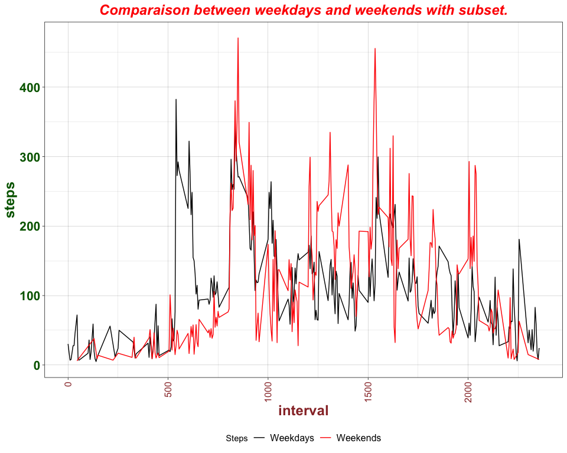<!-- -->

```r
print(my_plt_weekENDS_sub)
```

<!-- -->
<br>
12. EXTRA : Comparison between weekdays and weekend per hour

```r
for (i in 2:25) {
  my_tmp_plt <- (my_plt_weekDAYS_sub[[i]] + ggtitle("Weekdays",) + theme(plot.title = element_text(hjust = 0.5)) +
                   my_plt_weekENDS_sub[[i]] + ggtitle("Weekends")) + theme(plot.title = element_text(hjust = 0.5)) +
      plot_annotation(title = paste("Hour number :",i-1,sep=" "))
  print(my_tmp_plt)
}
```

<!-- -->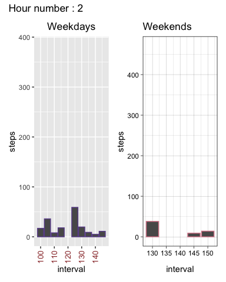<!-- --><!-- -->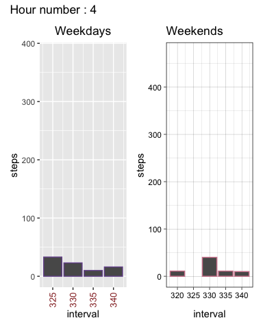<!-- -->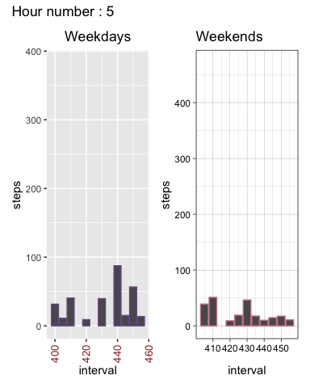<!-- -->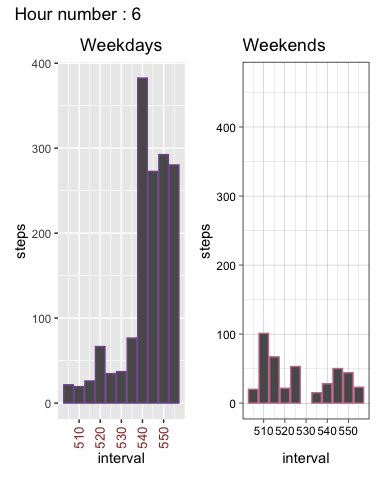<!-- --><!-- --><!-- --><!-- -->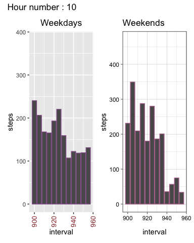<!-- -->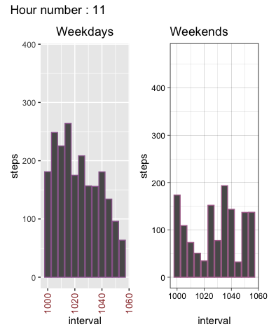<!-- -->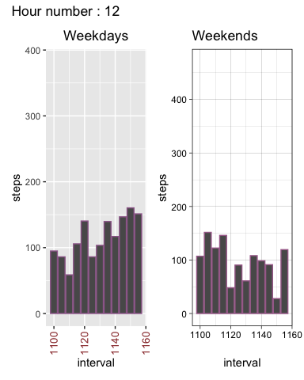<!-- -->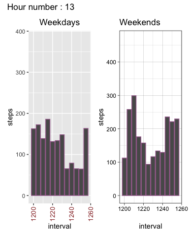<!-- --><!-- -->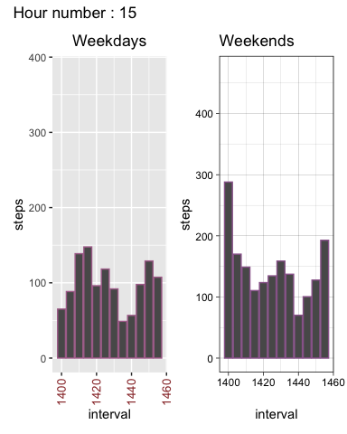<!-- -->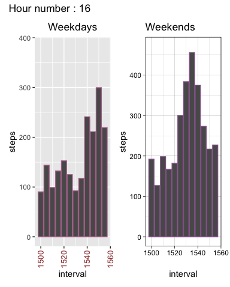<!-- -->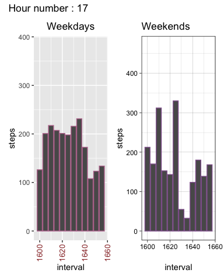<!-- -->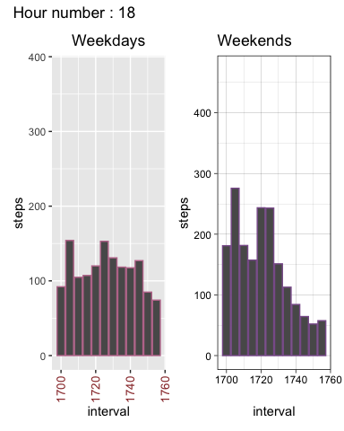<!-- --><!-- --><!-- --><!-- -->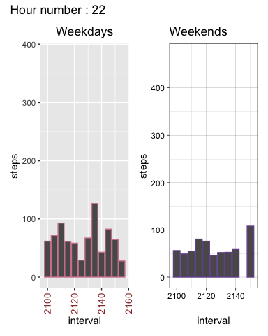<!-- --><!-- -->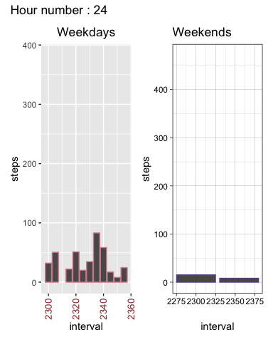<!-- -->

